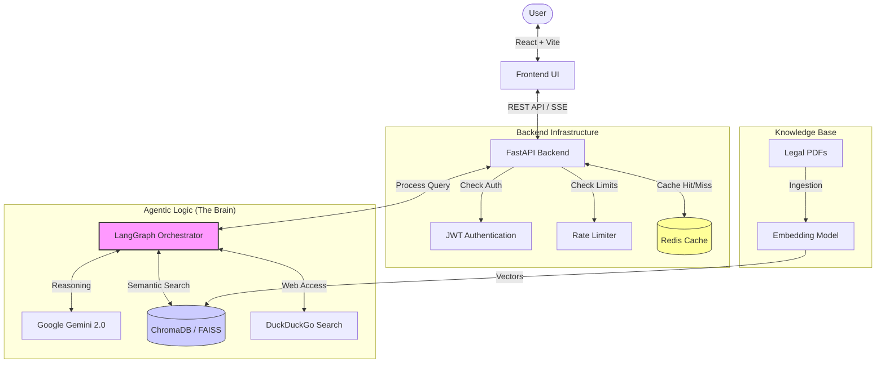
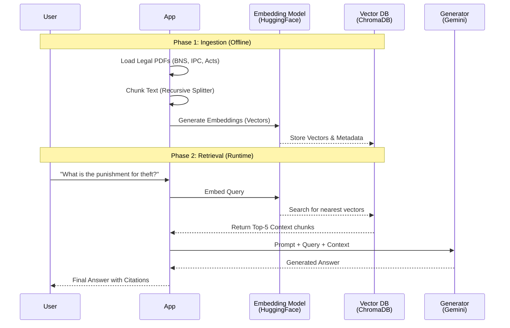

# NyayamGPT - Technical Architecture Guide

This document provides a technical breakdown of the NyayamGPT system, specifically designed to help explain the project architecture, data flow, and decision-making logic during technical interviews.

---

## 1. High-Level System Architecture

At a high level, NyayamGPT follows a **Microservice-like Architecture** (monolithic repo, modular code) where the Frontend communicates with a FastAPI Backend, which acts as a gateway to the Agentic Workflow.



**Key Explanation Points:**
- **FastAPI** handles the request/response cycle, auth, and rate limiting.
- **Redis** is used as a first-line cache. If a question was asked recently, we return the answer instantly (sub-millisecond latency).
- **LangGraph** is the "Manager" that dictates *how* to answer the question (Standard QA, Document Drafting, or Clarification).

---

## 2. The Agent Workflow (LangGraph)

This is the core differentiator. Unlike simple RAG chains which are linear (`Retrieve -> Generate`), NyayamGPT uses a **Cyclic Graph** to "think" before answering.

```mermaid
graph TD
    %% Nodes
    Start((Start)) --> Classify[Intent Classification]
    
    Classify --"Ambiguous?"--> Clarify[Collect Missing Details]
    Classify --"Draft Document?"--> DraftDoc[Draft Legal Document]
    Classify --"Legal Question"--> Rewrite[Query Rewriter]

    %% Clarification Path
    Clarify --> End((End))
    DraftDoc --> End

    %% Main QA Path
    Rewrite --> Expand[Query Expansion]
    Expand --> Retrieve[Retrieve Docs (Vector Store)]
    
    Retrieve --> CheckSearch{Docs Sufficient?}
    
    CheckSearch --"No"--> WebSearch[Search Case Law (Web)]
    CheckSearch --"Yes"--> DraftAns[Draft Answer]
    WebSearch --> DraftAns

    DraftAns --> CheckValid{High Risk?}
    
    CheckValid --"Yes"--> Validate[Validation Agent]
    CheckValid --"No"--> Simplify[Simplify Output]
    
    Validate --> Severity[Severity Check]
    Severity --> Simplify
    
    Simplify --> Extract[Extract Citations]
    Extract --> Resolve[Resolve URLs]
    Resolve --> Finalize[Finalize Response]
    Finalize --> End

    %% Styling
    classDef memory fill:#e1f5fe,stroke:#01579b;
    classDef logic fill:#fff3e0,stroke:#e65100;
    class CheckSearch,CheckValid,Classify logic;
    class Retrieve,WebSearch memory;
```

**Key Explanation Points:**
- **Routing**: The `Intent Classification` node decides if the user wants to *chat*, *draft a document*, or *ask a question*.
- **Self-Correction**: The `Validation Agent` acts as a "Supervisor". If the `Draft Answer` contains a high-risk crime (like police brutality), it forces a double-check to ensure the Victim/Perpetrator roles aren't swapped.
- **Dynamic Retrieval**: If local documents aren't enough (e.g., very recent case law), the graph dynamically decides to perform a `Web Search`.

---

## 3. The RAG Pipeline (Knowledge System)

This explains how the system "learns" and retrieves legal information accurately.



**Key Explanation Points:**
- **Hybrid Search**: We don't just search for keywords; we search for *meaning* (semantic search) using embeddings.
- **Context Injection**: The retrieved legal clauses are injected into the prompt so the LLM acts as a "Reader" rather than relying solely on its training data (reducing hallucinations).

---

## 4. Tech Stack Summary

| Component | Technology | Role |
|-----------|------------|------|
| **Frontend** | React, Vite, Tailwind | Responsive UI, Chat Interface |
| **Backend** | Python, FastAPI | API Server, Business Logic |
| **Orchestrator** | LangGraph | State Management, Agent Workflow |
| **LLM** | Google Gemini 2.0 | Reasoning, Generation |
| **Vector DB** | ChromaDB / FAISS | Storing/Retrieving Document Embeddings |
| **Embeddings** | HuggingFace (All-MiniLM) | Converting text to numbers |
| **Database** | SQLite / Redis | User Data & Caching |
