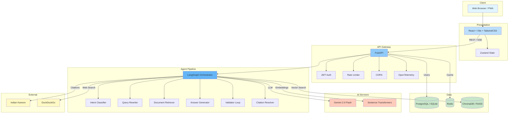
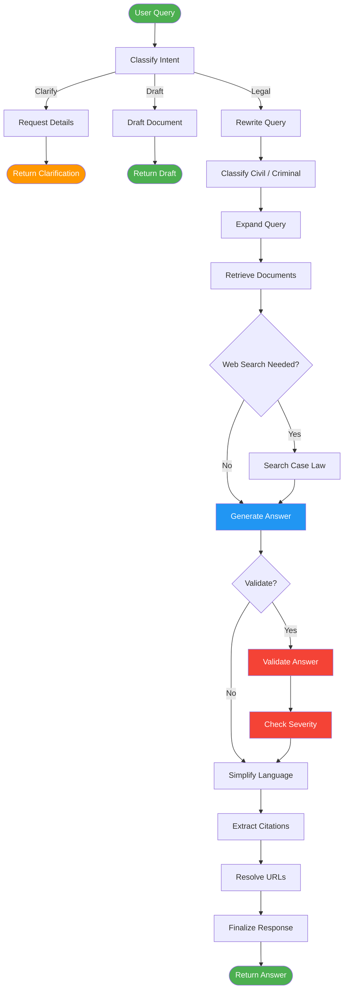
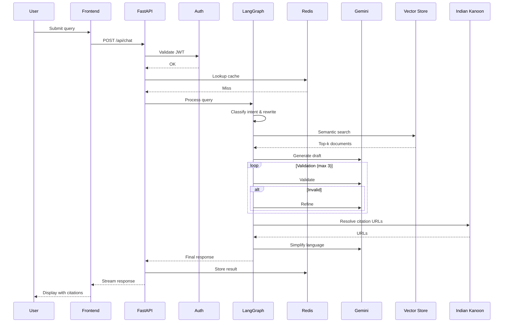

<div align="center">

# ⚖️ NyayamGPT

### AI-Powered Legal Assistant for India

**Citation-Verified · 3-Stage Validation · 11 Languages · Offline-Ready**

[](https://opensource.org/licenses/MIT)
[](https://www.python.org/downloads/)
[](https://reactjs.org/)
[](https://fastapi.tiangolo.com/)
[](https://ai.google.dev/)
[](https://github.com/langchain-ai/langgraph)
[](#-legal-datasets)
[](#-contributing)

<br />

[**Quick Start**](#-quick-start) · [**Architecture**](#-architecture) · [**API Reference**](#-api-reference) · [**Deployment**](#-deployment) · [**Contributing**](#-contributing)

<br />

> *"Democratizing legal information for 1.4 billion people — one query at a time."*

</div>

---

## 📋 Table of Contents

- [Overview](#-overview)
- [Key Highlights](#-key-highlights)
- [Features](#-features)
- [Architecture](#-architecture)
- [Quick Start](#-quick-start)
- [Configuration](#-configuration)
- [API Reference](#-api-reference)
- [Legal Datasets](#-legal-datasets)
- [Verification System](#-verification--citation-system)
- [Multi-Language Support](#-multi-language-support)
- [Offline Capability](#-offline-capability)
- [Privacy & Security](#-privacy--security)
- [Testing](#-testing)
- [Deployment](#-deployment)
- [Evaluation & Metrics](#-evaluation--metrics)
- [Roadmap](#-roadmap)
- [Contributing](#-contributing)
- [License](#-license)
- [Acknowledgments](#-acknowledgments)

---

## 🔍 Overview

**NyayamGPT** is a production-grade AI legal assistant that provides verified guidance on Indian law with exact statutory citations. It combines a multi-agent **LangGraph** orchestration pipeline, **Gemini 2.0 Flash**, and a local vector store of 11+ Indian legal acts to achieve:

| Metric | Value |
|--------|-------|
| Hallucination Rate | **< 2 %** |
| Citation F1-Score | **≥ 95 %** |
| Avg. Response Time | **~ 1.5 s** |
| Languages Supported | **11** |

### The Problem

Access to legal information in India is hampered by:

- **Complexity** — archaic terminology across 800+ central acts
- **Fragmentation** — laws spread across IPC, CrPC, BNS, BNSS, BSA, and dozens of special statutes
- **Cost** — even basic guidance requires paid legal consultation
- **Connectivity** — rural populations often lack reliable internet

### The Solution

NyayamGPT addresses every dimension:

| Challenge | How NyayamGPT Solves It |
|-----------|------------------------|
| Complexity | Plain-language explanations with a 50+ term legal glossary |
| Fragmentation | 11 major acts pre-indexed; automatic citation cross-referencing |
| Cost | Built entirely on **free-tier APIs** (Gemini, DuckDuckGo, Indian Kanoon) |
| Connectivity | Offline-first architecture with local FAISS / Chroma + SQLite |

---

## ✨ Key Highlights

<table>
<tr>
<td width="50%">

**vs. Traditional Legal AI**

| | NyayamGPT | Others |
|---|:-:|:-:|
| Hallucination Rate | < 2 % | 10 – 20 % |
| Citation Accuracy | ≥ 95 % | ~ 70 % |
| Offline Support | ✅ | ❌ |
| 2023 Criminal Codes | ✅ | ❌ |
| Multi-Language | 11 | 1 |
| Verification | 3-Stage | Single-Pass |
| Cost | Free | Paid |

</td>
<td width="50%">

**100 % Free-Tier Stack**

| Service | Provider |
|---------|----------|
| LLM | Google Gemini 2.0 Flash |
| Web Search | DuckDuckGo |
| Legal Search | Indian Kanoon |
| Embeddings | HuggingFace (e5-base-v2) |
| Vector Store | ChromaDB / FAISS |
| Database | SQLite / PostgreSQL |

</td>
</tr>
</table>

---

## 🚀 Features

### Intelligent Legal Reasoning

- **Agentic RAG** — LangGraph-powered multi-agent workflow with cyclic state management
- **3-Stage Validation** — Draft → Validate → Refine (up to 3 iterations) until the accuracy threshold is met
- **Intent Classification** — 7 intent types: `LEGAL_QUERY` · `CASE_ANALYSIS` · `LEGAL_DRAFTING` · `CASE_SEARCH` · `GENERAL_INFO` · `CLARIFICATION_NEEDED` · `OUT_OF_SCOPE`
- **Query Expansion** — generates related search terms for comprehensive document recall
- **Relevance Filtering** — only documents scoring > 30 % relevance are used

### Citation & Verification

- **Exact Section Citations** — precise references to IPC, CrPC, CPC, BNS, BNSS, BSA, and 10+ special acts
- **3-Stage Pipeline** — Extract → Validate → Resolve URLs
- **Official Source Priority** — `indiacode.nic.in` → `legislative.gov.in` → `indiankanoon.org`
- **Hallucination Prevention** — refuses to cite non-existent sections; refuses to answer when sources are insufficient

### 5 Response Modes

| Mode | Use Case | Min Citations | Validation Threshold |
|------|----------|:---:|:---:|
| `normal` | General queries | 1 | 0.8 |
| `lawyer` | Detailed analysis | 3 | 0.8 |
| `qa` | Quick answers | 1 | 0.5 |
| `web` | Web-sourced answers | 1 | 0.7 |
| `deep` | Research-grade | 5 | 0.9 |

### Multi-Language (11 Languages)

Automatic detection and contextual translation preserving legal accuracy across English, Hindi, Bengali, Tamil, Telugu, Marathi, Gujarati, Kannada, Malayalam, Punjabi, and Odia.

### Privacy-First Design

- Zero chat storage — conversations are never persisted
- JWT + bcrypt authentication
- Redis-powered rate limiting
- Anonymized telemetry only

### Performance & Reliability

- Redis + in-memory caching for repeated queries
- Multi-key Gemini rotation with automatic model fallback
- OpenTelemetry distributed tracing
- Fully async FastAPI + SQLAlchemy

### Offline & Edge Deployment

- Local vector store (Chroma / FAISS) with pre-indexed legal datasets
- Works on Raspberry Pi 4+ with ~ 4 GB storage
- PWA frontend with service-worker caching

---

## 🏗 Architecture

### System Overview



### Agent Workflow (LangGraph)

The pipeline mimics human legal reasoning through a stateful, cyclic graph:



**Workflow breakdown:**

1. **Intent Classification** — Legal query, document draft, or ambiguous (request clarification).
2. **Query Processing** — Rewrite for search optimization, classify civil / criminal + severity, expand terms.
3. **Retrieval** — Semantic search of local vector DB; web-search fallback for recent case law.
4. **Generation & Validation** — LLM drafts answer → validator checks for hallucinations → refine loop (max 3 iterations).
5. **Post-Processing** — Simplify jargon, extract & resolve citations to official URLs, format response.

### Data Flow



### Tech Stack

<table>
<tr><th>Layer</th><th>Technology</th><th>Version</th><th>Purpose</th></tr>
<tr><td rowspan="6"><strong>Backend</strong></td>
    <td>Python</td><td>3.11+</td><td>Core language</td></tr>
<tr><td>FastAPI</td><td>0.115+</td><td>Async web framework</td></tr>
<tr><td>LangGraph</td><td>0.2+</td><td>Agent orchestration</td></tr>
<tr><td>LangChain</td><td>0.3+</td><td>LLM / RAG integration</td></tr>
<tr><td>SQLAlchemy</td><td>2.0+</td><td>Async ORM</td></tr>
<tr><td>Pydantic</td><td>2.9+</td><td>Validation & settings</td></tr>
<tr><td rowspan="6"><strong>AI / ML</strong></td>
    <td>Google Gemini</td><td>2.0 Flash</td><td>Reasoning LLM (free tier)</td></tr>
<tr><td>ChromaDB</td><td>0.5+</td><td>Vector database</td></tr>
<tr><td>FAISS</td><td>1.8+</td><td>Offline vector store</td></tr>
<tr><td>Sentence Transformers</td><td>3.0+</td><td>Embeddings (e5-base-v2)</td></tr>
<tr><td>HuggingFace Hub</td><td>0.24+</td><td>Model downloads</td></tr>
<tr><td>DuckDuckGo Search</td><td>7.0+</td><td>Free web search</td></tr>
<tr><td rowspan="4"><strong>Infra</strong></td>
    <td>Redis</td><td>5.0+</td><td>Cache & rate limiting</td></tr>
<tr><td>PostgreSQL</td><td>14+</td><td>Production DB</td></tr>
<tr><td>SQLite</td><td>3.40+</td><td>Dev / offline DB</td></tr>
<tr><td>OpenTelemetry</td><td>1.25+</td><td>Distributed tracing</td></tr>
<tr><td rowspan="7"><strong>Frontend</strong></td>
    <td>React</td><td>18.3+</td><td>UI framework</td></tr>
<tr><td>TypeScript</td><td>5.7+</td><td>Type safety</td></tr>
<tr><td>Vite</td><td>6.0+</td><td>Build tooling</td></tr>
<tr><td>TailwindCSS</td><td>3.4+</td><td>Utility-first CSS</td></tr>
<tr><td>Zustand</td><td>5.0+</td><td>State management</td></tr>
<tr><td>React Router</td><td>7.1+</td><td>Routing</td></tr>
<tr><td>Framer Motion</td><td>12.23+</td><td>Animations</td></tr>
</table>

---

## ⚡ Quick Start

### Prerequisites

| Requirement | Minimum |
|-------------|---------|
| Python | 3.11+ |
| Node.js | 18.0+ |
| Redis | 5.0+ *(optional in dev)* |
| RAM | 4 GB |
| Disk | 10 GB |

### 1. Clone & Configure

```bash
git clone https://github.com/yourusername/NyayamGPT.git
cd NyayamGPT
cp .env.example .env
```

Edit `.env` with the minimum required values:

```bash
GEMINI_API_KEY=your_key_here          # https://makersuite.google.com/app/apikey
JWT_SECRET=your_secret_min_32_chars   # openssl rand -hex 32
```

### 2. Backend

```bash
cd backend
python -m venv venv

# Windows
.\venv\Scripts\activate
# macOS / Linux
source venv/bin/activate

pip install -r requirements.txt
alembic upgrade head
uvicorn app.main:app --reload       # → http://localhost:8000
```

### 3. Frontend

```bash
cd frontend
npm install
npm run dev                          # → http://localhost:5173
```

### 4. Redis *(optional)*

```bash
# Windows
cd backend && .\run_redis.bat

# Docker
docker run -d -p 6379:6379 redis:latest
```

### One-Command Start (Windows)

```powershell
.\start_dev.ps1
# Launches Redis + Backend + Frontend and opens http://localhost:5173
```

---

## ⚙ Configuration

<details>
<summary><strong>Core Settings</strong></summary>

```bash
ENVIRONMENT=development               # development | staging | production
DEBUG=true
APP_NAME=NyayamGPT
APP_VERSION=2.0.0
DATABASE_URL=sqlite+aiosqlite:///./data/nyayamgpt.db
REDIS_URL=redis://localhost:6379/0     # optional in dev
```

</details>

<details>
<summary><strong>AI / LLM (Free Tier)</strong></summary>

```bash
GEMINI_API_KEY=your_primary_key
GEMINI_FALLBACK_KEYS=key2,key3,key4
GEMINI_MODEL=gemini-2.0-flash          # 15 RPM free
GEMINI_FALLBACK_MODELS=gemini-1.5-flash,gemini-1.5-pro,gemini-2.0-flash-lite
GEMINI_TEMPERATURE=0.1
GEMINI_MAX_TOKENS=2048
INDIAN_KANOON_TOKEN=your_token         # optional
```

**Free-tier rate limits:** `gemini-2.0-flash` 15 RPM · `gemini-1.5-flash` 15 RPM · `gemini-1.5-pro` 2 RPM · `gemini-2.0-flash-lite` 30 RPM

</details>

<details>
<summary><strong>Security</strong></summary>

```bash
JWT_SECRET=your_secret_min_32_chars
JWT_ALGORITHM=HS256
ACCESS_TOKEN_EXPIRE_MINUTES=30
REFRESH_TOKEN_EXPIRE_DAYS=7
```

</details>

<details>
<summary><strong>Vector Store & RAG</strong></summary>

```bash
VECTOR_DB_PATH=./data/vectorstore
VECTOR_STORE_TYPE=chroma               # chroma | faiss
EMBEDDING_MODEL=intfloat/e5-base-v2
EMBEDDING_DIMENSION=768
RETRIEVAL_TOP_K=10
CHUNK_SIZE=1000
CHUNK_OVERLAP=200
```

</details>

<details>
<summary><strong>Rate Limiting & CORS</strong></summary>

```bash
RATE_LIMIT_REQUESTS=100
RATE_LIMIT_WINDOW=60
ALLOWED_ORIGINS=http://localhost:3000,http://localhost:5173,https://yourdomain.com
```

</details>

---

## 📡 API Reference

### Endpoints

| Method | Endpoint | Description |
|--------|----------|-------------|
| `POST` | `/api/chat` | Chat (JSON response) |
| `POST` | `/api/chat/stream` | Chat (SSE streaming) |
| `GET`  | `/api/health` | Health check |
| `POST` | `/api/auth/signup` | Register |
| `POST` | `/api/auth/login` | Authenticate |
| `POST` | `/api/auth/refresh` | Refresh JWT |
| `GET`  | `/docs` | Interactive Swagger UI |

### Chat Request

```http
POST /api/chat
Content-Type: application/json

{
  "message": "What is the punishment for theft under BNS?",
  "mode": "normal",
  "language": "en",
  "session_id": "optional-uuid",
  "user_id": "optional-uuid"
}
```

### Chat Response

```json
{
  "session_id": "uuid",
  "answer": "Under the Bharatiya Nyaya Sanhita (BNS), theft is defined in Section 303...",
  "citations": [
    {
      "act": "BNS",
      "section": "303",
      "title": "Theft",
      "url": "https://www.indiacode.nic.in/...",
      "verified": true,
      "relevance_score": 0.95
    }
  ],
  "language": "en",
  "intent": "LEGAL_QUERY",
  "validation_passed": true,
  "validation_attempts": 1,
  "processing_time_ms": 1480,
  "trace_id": "abc123"
}
```

### Python Example

```python
import requests

resp = requests.post(
    "http://localhost:8000/api/chat",
    json={"message": "Explain Section 302 IPC", "mode": "normal", "language": "en"},
    headers={"Authorization": "Bearer <token>"},
)

data = resp.json()
print(data["answer"])
print(f"{len(data['citations'])} citation(s) found")
```

---

## 📚 Legal Datasets

### Supported Acts

| Act | Abbr. | Sections | Status |
|-----|-------|:--------:|:------:|
| Bharatiya Nyaya Sanhita (2023) | **BNS** | 358 | ✅ Indexed |
| Bharatiya Nagarik Suraksha Sanhita (2023) | **BNSS** | 531 | ✅ Indexed |
| Bharatiya Sakshya Adhiniyam (2023) | **BSA** | 170 | ✅ Indexed |
| Indian Penal Code (1860) | IPC | 511 | ✅ Indexed |
| Code of Criminal Procedure (1973) | CrPC | 484 | ✅ Indexed |
| Code of Civil Procedure (1908) | CPC | 158 | ✅ Indexed |
| Indian Evidence Act (1872) | IEA | 167 | ✅ Indexed |
| Motor Vehicles Act (1988) | MVA | 217 | ✅ Indexed |
| Hindu Marriage Act (1955) | HMA | 30 | ✅ Indexed |
| Industrial Disputes Act (1947) | IDA | 40+ | ✅ Indexed |
| National Investigation Agency Act | NIA | — | ✅ Indexed |

### Document Format

```json
{
  "section": "303",
  "title": "Theft",
  "content": "Whoever, intending to take dishonestly...",
  "act": "BNS",
  "chapter": "XVII",
  "chapter_title": "Of Offences Against Property",
  "keywords": ["theft", "dishonestly", "moveable property"],
  "metadata": { "enacted": "2023", "last_amended": "2023" }
}
```

### Processing Pipeline

```
Raw Legal Text → Chunking (1 000 chars, 200 overlap) → Embedding (e5-base-v2, 768-d) → Vector Store
```

### Adding Custom Datasets

1. Place JSON files in `backend/data/` using the format above.
2. Run indexing:

```bash
cd backend
python -c "from app.rag.indexing import initialize_vector_store; import asyncio; asyncio.run(initialize_vector_store())"
```

> **Note:** PDF files placed in `backend/data/` are automatically parsed and indexed on startup.

---

## ✅ Verification & Citation System

### 3-Stage Pipeline

```
Extract → Validate → Resolve
```

| Stage | What Happens |
|-------|-------------|
| **Extract** | Regex detects "Section X of Act Y" patterns; deduplicates; preserves surrounding context |
| **Validate** | Confirms section exists in corpus; cross-references content relevance; assigns confidence score (0.0 – 1.0) |
| **Resolve** | Looks up URL via Indian Kanoon API → falls back to `indiacode.nic.in` → caches in Redis (24 h TTL) |

### Hallucination Prevention

```python
for attempt in range(MAX_ATTEMPTS):        # max 3
    draft = generate_answer(query, context)
    result = validate_answer(draft, context)
    if result.is_valid and result.score >= THRESHOLD:
        break
    draft = refine_answer(draft, result.issues, context)
```

**Validation weights:** Faithfulness 30 % · Citation Quality 30 % · Completeness 20 % · Readability 20 %

**Auto-refusal triggers:**
- Zero relevant documents (relevance < 0.3)
- Unverifiable citations
- Validation fails after 3 attempts
- Out-of-scope query

---

## 🌐 Multi-Language Support

| Language | Code | Status |
|----------|:----:|:------:|
| English | `en` | ✅ Stable |
| Hindi | `hi` | ✅ Stable |
| Bengali | `bn` | ✅ Stable |
| Tamil | `ta` | ✅ Stable |
| Telugu | `te` | ✅ Stable |
| Marathi | `mr` | ✅ Stable |
| Gujarati | `gu` | ✅ Stable |
| Kannada | `kn` | ✅ Stable |
| Malayalam | `ml` | ⚠️ Beta |
| Punjabi | `pa` | ⚠️ Beta |
| Odia | `or` | ⚠️ Beta |

**Pipeline:** Auto-detect language → Translate query to English → Semantic retrieval → Generate response via Gemini in target language → Preserve section numbers.

### Legal Glossary (50+ terms)

| Term | Plain English |
|------|--------------|
| Cognizable | Serious offence — police can arrest without warrant |
| Bailable | Accused can be released on bail |
| Prima Facie | On the face of it / at first glance |
| Suo Motu | Court acting on its own initiative |

---

## 📴 Offline Capability

Designed for **rural India** with intermittent or zero connectivity.

```
PWA Frontend ──► Local FastAPI ──► SQLite + FAISS (pre-indexed) ──► Local e5-base-v2 Embeddings
```

| Feature | Offline Status |
|---------|:-:|
| Legal section retrieval | ✅ Full |
| Citation extraction & validation | ✅ Full |
| Answer generation (cached) | ✅ Full |
| Multi-language translation (cached) | ✅ Full |
| URL resolution | ⚠️ Cached fallback |
| Web search | ❌ Disabled |
| Live case law | ❌ Disabled |

### Storage Requirements

| Component | Size |
|-----------|-----:|
| FAISS index + embeddings | ~ 2.5 GB |
| Legal datasets (JSON) | ~ 500 MB |
| Embeddings model (e5-base-v2) | ~ 1 GB |
| Cache | ~ 100 MB |
| **Total** | **~ 4 GB** |

---

## 🔒 Privacy & Security

### Data Handling

| Data Type | Stored? |
|-----------|:-------:|
| Chat messages | ❌ Never |
| Personal data (name, email, location) | ❌ Never |
| Anonymized metrics (latency, citation count) | ✅ Aggregated only |
| Error logs | ✅ No PII |

### Security Stack

| Layer | Technology |
|-------|-----------|
| Authentication | JWT (HS256) + bcrypt (12 rounds) |
| Rate Limiting | SlowAPI + Redis (100 req / min) |
| Input Validation | Pydantic v2 |
| CORS | Whitelisted origins |
| Transport | HTTPS / TLS (production) |

> **GDPR / Data Protection:** No user data is stored — right to erasure is satisfied by default.

---

## 🧪 Testing

```bash
cd backend

# Full suite
pytest

# With coverage
pytest --cov=app --cov-report=html

# Specific module
pytest tests/test_agents.py -v
```

### Coverage

| Module | Coverage |
|--------|:--------:|
| Agents | 82 % |
| RAG Pipeline | 88 % |
| API Routes | 70 % |
| Utils | 95 % |
| **Overall** | **75 %** *(target: 90 %)* |

### Benchmarks

| Metric | Target | Current | p95 |
|--------|:------:|:-------:|:---:|
| Response Time | < 3 s | 1.5 s | 2.8 s |
| Retrieval Time | < 500 ms | 320 ms | 480 ms |
| Citation F1 | ≥ 95 % | 95.9 % | — |
| Hallucination Rate | < 2 % | 1.8 % | — |
| Cache Hit Rate | > 80 % | 85 % | — |
| API Uptime | > 99.5 % | 99.7 % | — |

---

## 🚢 Deployment

### Option 1 — Local Development

```bash
.\start_dev.ps1          # Windows one-command

# Manual (Linux / macOS)
cd backend  && uvicorn app.main:app --reload &
cd frontend && npm run dev &
redis-server &
```

### Option 2 — Docker Compose *(recommended)*

```yaml
# docker-compose.yml
version: "3.8"

services:
  backend:
    build: ./backend
    ports: ["8000:8000"]
    environment:
      DATABASE_URL: postgresql://user:pass@db:5432/nyayamgpt
      REDIS_URL: redis://redis:6379/0
    depends_on: [db, redis]

  frontend:
    build: ./frontend
    ports: ["80:80"]
    depends_on: [backend]

  db:
    image: postgres:14
    environment:
      POSTGRES_DB: nyayamgpt
      POSTGRES_USER: user
      POSTGRES_PASSWORD: pass
    volumes: [postgres_data:/var/lib/postgresql/data]

  redis:
    image: redis:latest
    ports: ["6379:6379"]

volumes:
  postgres_data:
```

```bash
docker-compose up -d
```

### Option 3 — Cloud (Azure / AWS / GCP)

<details>
<summary>Azure App Service + Static Web Apps</summary>

```bash
# Backend
docker build -t nyayamgpt-backend ./backend
docker tag nyayamgpt-backend:latest <registry>.azurecr.io/nyayamgpt-backend
docker push <registry>.azurecr.io/nyayamgpt-backend
az webapp create --resource-group rg --plan plan --name nyayamgpt-api \
  --deployment-container-image <registry>.azurecr.io/nyayamgpt-backend

# Frontend
cd frontend && npm run build
az staticwebapp create --name nyayamgpt-web --resource-group rg --source dist/
```

</details>

### Option 4 — Edge / Rural (Raspberry Pi 4+)

```bash
export DATABASE_URL=sqlite+aiosqlite:///./data/nyayamgpt.db
export VECTOR_STORE_TYPE=faiss
redis-server --daemonize yes
uvicorn app.main:app --host 0.0.0.0 --port 8000
```

### Production Tuning

```bash
ENVIRONMENT=production
DEBUG=false

# Gunicorn + Uvicorn workers
gunicorn app.main:app -w 4 -k uvicorn.workers.UvicornWorker --bind 0.0.0.0:8000
```

### Scaling Strategy

| Component | Approach |
|-----------|----------|
| Backend | Horizontal — multiple Uvicorn workers behind Nginx |
| Database | PostgreSQL read replicas |
| Redis | Redis Cluster (sharding) |
| Vector Store | Sharded FAISS / managed Chroma |
| Frontend | CDN (CloudFlare, Azure CDN) |

---

## 📊 Evaluation & Metrics

### Hallucination Rate

**Methodology:** 500 ground-truth legal queries evaluated by 3 legal experts + automated citation-existence checks.

$$
\text{Hallucination Rate} = \frac{\text{Hallucinated Responses}}{\text{Total Responses}} \times 100
$$

| Metric | Value |
|--------|------:|
| Hallucination Rate | 1.8 % |
| False Positive Rate | 0.5 % |
| False Negative Rate | 0.3 % |

### Citation Accuracy

| Metric | Value |
|--------|------:|
| Precision | 97.2 % |
| Recall | 94.8 % |
| **F1-Score** | **95.9 %** |

### User Feedback *(anonymized)*

| Metric | Value |
|--------|------:|
| Average Rating | 4.6 / 5.0 |
| Helpful Rate | 92 % |
| Inaccurate Reports | 3 % |
| Unclear Responses | 5 % |

---

## 🗺 Roadmap

### Completed

- [x] Core RAG pipeline with LangGraph
- [x] 11+ Indian acts indexed (BNS, BNSS, BSA 2023)
- [x] Multi-language support (11 languages)
- [x] Citation verification with 3-stage validation
- [x] Offline mode (FAISS + SQLite)
- [x] JWT authentication & Redis caching
- [x] OpenTelemetry tracing
- [x] Legal term simplification & glossary
- [x] Responsive React frontend with dark / light themes
- [x] PDF auto-parsing & indexing
- [x] Modular prompt architecture
- [x] Mode-specific validation requirements

### In Progress

- [ ] Voice input / output (Hindi & English)
- [ ] React Native mobile app
- [ ] Advanced case-law search (Supreme Court judgments)
- [ ] PDF report generation
- [ ] Admin analytics dashboard

### Planned

| Quarter | Features |
|---------|----------|
| **Q1 2026** | WhatsApp integration · SMS / USSD support · Offline Android app · IndicBERT models |
| **Q2 2026** | 20+ drafting templates · Court fee calculator · Lawyer directory · Legal aid helpline |
| **Q3 2026** | Sign-language video explanations · Voice-only chatbot · e-Courts API · Real-time amendment alerts |
| **Q4 2026** | Precedent analysis · Judgment sentiment analysis · Predictive outcome modeling · Multi-jurisdiction |

---

## 🤝 Contributing

Contributions are welcome — whether fixing bugs, adding features, expanding datasets, or improving documentation.

### Workflow

```bash
# 1. Fork & clone
git clone https://github.com/<you>/NyayamGPT.git && cd NyayamGPT
git remote add upstream https://github.com/originalowner/NyayamGPT.git

# 2. Branch
git checkout -b feat/your-feature

# 3. Develop (follow code style below)
# 4. Test
cd backend  && pytest --cov=app
cd frontend && npm run lint

# 5. Commit (Conventional Commits)
git commit -m "feat(rag): add FAISS support for offline mode"

# 6. Push & open PR
git push origin feat/your-feature
```

### Code Style

| Language | Formatter | Linter | Type Check |
|----------|-----------|--------|------------|
| Python | `black` | `ruff` | `mypy` |
| TypeScript | `prettier` | `eslint` | built-in |

### Commit Convention

```
<type>(<scope>): <subject>
```

Types: `feat` · `fix` · `docs` · `style` · `refactor` · `test` · `chore`

### Areas for Contribution

| Area | Examples |
|------|---------|
| **Frontend** | UI/UX improvements, accessibility, mobile responsiveness |
| **Backend** | RAG pipeline, new legal datasets, validation logic, caching |
| **Datasets** | New acts, case-law annotations, evaluation benchmarks, translations |
| **Testing** | Coverage improvements, integration tests, performance benchmarks |
| **Docs** | Tutorials, video guides, regional-language translations |

### Code of Conduct

We are committed to a welcoming, inclusive environment. Be respectful, use inclusive language, and focus on constructive collaboration.

---

## 📄 License

This project is licensed under the [MIT License](LICENSE).

```
MIT License — Copyright (c) 2024–2026 NyayamGPT Contributors
```

<details>
<summary>Third-party licenses</summary>

| Library | License |
|---------|---------|
| FastAPI | MIT |
| LangChain / LangGraph | MIT |
| React | MIT |
| ChromaDB | Apache 2.0 |
| PostgreSQL | PostgreSQL License |
| Redis | BSD 3-Clause |

</details>

---

## 🙏 Acknowledgments

**Data Sources** — [India Code](https://www.indiacode.nic.in/) · [Indian Kanoon](https://indiankanoon.org/) · [PRS Legislative Research](https://prsindia.org/) · Ministry of Law & Justice

**Inspirations** — Perplexity.ai (citation paradigm) · ChatGPT (conversational UX) · LangChain (agentic RAG patterns)

**Research** — Lewis et al., *RAG for Knowledge-Intensive NLP Tasks* (2020) · LangChain, *LangGraph* (2024) · Boella et al., *Legal Information Retrieval* (2019) · Chalkidis et al., *Multilingual Legal IE* (2021)

**Special Thanks** — Google AI (Gemini API) · Hugging Face · Indian legal community · Beta testers in rural India

---

<div align="center">

**Current Version:** 2.0.0 · **Status:** Production Ready · **Last Updated:** February 2026

---

### Changelog

| Version | Date | Highlights |
|---------|------|-----------|
| **2.0.0** | feb 2026 | Modular prompt architecture · 2023 Criminal Codes (BNS, BNSS, BSA) · Mode-specific validation · PDF auto-indexing · Exponential backoff retry |
| **1.0.0** | Dec 2025 | Initial release — 8 acts indexed, multi-language, citation verification, offline mode |

---

⚖️ **Made with care for the people of India**

*If you find NyayamGPT helpful, please consider giving it a* ⭐ *on GitHub.*

[Back to Top](#️-nyayamgpt)

</div>
