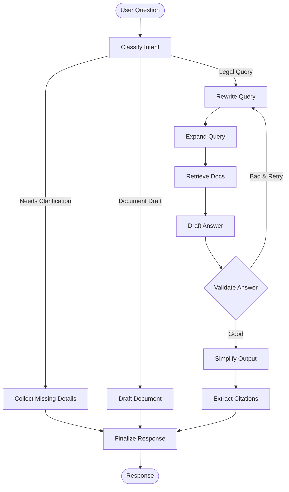

# LangGraph: Complete Deep Dive for Interview

## Table of Contents
1. [Why LangGraph? (The Problem It Solves)](#1-why-langgraph)
2. [Core Concepts](#2-core-concepts)
3. [State Management](#3-state-management)
4. [Nodes & Edges](#4-nodes-and-edges)
5. [Conditional Routing](#5-conditional-routing)
6. [Your Project's Implementation](#6-project-implementation)
7. [Interview Q&A](#7-interview-qa)

---

## 1. Why LangGraph? (The Problem It Solves)

### 1.1 The Problem with LangChain Chains

**LangChain** uses **DAGs** (Directed Acyclic Graphs) - "Chains":
```
User Query → Retrieval → Generation → Output
   A      →      B     →      C      →   D
```

**Problems:**
1. **No Loops**: What if the generated answer is bad? Can't go back to retry.
2. **No Conditional Logic**: Must follow A→B→C→D every time.
3. **No Self-Correction**: Can't validate and improve results.

**Example Failure:**
```
User: "What is Section 302?"
Retrieval: Returns Section 301 (wrong!)
Generation: "Section 301 deals with..." (garbage in, garbage out)
Output: Wrong answer, no way to fix it
```

### 1.2 The Solution: LangGraph

**LangGraph** adds **Cycles** (Loops) and **Conditional Routing**:

```
User Query → Retrieval → Validation
   A      →      B     →      C
                          ↓
                    Is Good? ←─┐
                    ├─ No  ────┘ (Loop back to B!)
                    └─ Yes → Generation → Output
```

**Real Power:**
- Can **retry** if retrieval is bad
- Can **route** based on query type
- Can **self-correct** with validation loops
- Can **ask for clarification** if query is vague

---

## 2. Core Concepts

### 2.1 The Three Building Blocks

**1. State** (Shared Memory)
```python
class GraphState(TypedDict):
    question: str           # User's question
    documents: List[str]    # Retrieved docs
    generation: str         # Generated answer
    attempts: int           # Retry counter
```

**2. Nodes** (Processing Steps)
```python
def retrieve_node(state: GraphState):
    docs = vector_store.search(state["question"])
    return {"documents": docs}
```

**3. Edges** (Flow Control)
```python
# Simple edge: Always go A → B
workflow.add_edge("retrieve", "generate")

# Conditional edge: Go to different nodes based on logic
workflow.add_conditional_edges(
    "validate",
    check_quality,
    {
        "good": "finalize",
        "bad": "retrieve"  # Retry!
    }
)
```

### 2.2 Real-World Analogy: Customer Service

**LangChain (Linear):**
```
Customer calls → Agent reads script → Ends call
(If script doesn't help, too bad!)
```

**LangGraph (Intelligent):**
```
Customer calls → Agent reads script
               → Is problem solved?
                  ├─ Yes → End call
                  └─ No  → Ask more questions
                          → Try different script
                          → Is solved now?
                             ├─ Yes → End call
                             └─ No  → Escalate to manager
```

---

## 3. State Management

### 3.1 What is State?

State is a **shared dictionary** that all nodes can read and write to.

**Your Project's State:**
```python
from typing import TypedDict, List, Optional

class GraphState(TypedDict):
    # Input
    question: str                    # User's original question
    session_id: Optional[str]        # Chat session ID
    language: str                    # Response language
    mode: str                        # Chat mode
    
    # Processing
    intent: str                      # Classified intent
    rewritten_question: str          # Optimized query
    query_classification: dict       # Query analysis
    
    # Retrieval
    documents: List[dict]            # Retrieved laws
    context: str                     # Formatted context
    
    # Generation
    generation: str                  # AI response
    citations: List[str]             # Legal citations
    
    # Metadata
    attempts: int                    # Retry counter
    validation_passed: bool          # Quality check
    error: Optional[str]             # Error if any
```

### 3.2 How Nodes Update State

**Node Structure:**
```python
def my_node(state: GraphState) -> GraphState:
    # 1. Read from state
    question = state["question"]
    
    # 2. Do some work
    result = process(question)
    
    # 3. Return UPDATE (not full state!)
    return {
        "rewritten_question": result,
        "attempts": state["attempts"] + 1
    }
```

**Key Point:** You return a **partial update**. LangGraph merges it with the existing state.

```python
# Before node:
state = {"question": "What is IPC 302?", "attempts": 0}

# Node returns:
{"rewritten_question": "IPC Section 302 punishment details", "attempts": 1}

# After merge:
state = {
    "question": "What is IPC 302?",  # Original value kept
    "rewritten_question": "IPC Section 302 punishment details",  # New
    "attempts": 1  # Updated
}
```

---

## 4. Nodes & Edges

### 4.1 What is a Node?

A node is just a Python function that:
1. Takes `GraphState` as input
2. Does some processing
3. Returns a dictionary with updates

**Example from Your Project:**
```python
from opentelemetry import trace

tracer = trace.get_tracer(__name__)

@tracer.start_as_current_span("node_retrieve_docs")
async def node_retrieve_docs(state: GraphState) -> GraphState:
    \"\"\"
    Retrieve relevant legal documents from vector store.
    \"\"\"
    # Read from state
    question = state["rewritten_question"]
    
    # Do the work
    logger.info(f"Retrieving docs for: {question}")
    docs = await search_vectorstore(
        query=question,
        top_k=5,
        filter_metadata=None
    )
    
    # Format documents
    context = _format_docs_as_context(docs)
    
    # Return updates
    return {
        "documents": _docs_to_dict_list(docs),
        "context": context
    }
```

**Important:** Notice:
- Uses `async` for non-blocking I/O
- Has OpenTelemetry tracing for debugging
- Logs what it's doing
- Returns only the fields it changed

### 4.2 What is an Edge?

Edges connect nodes, defining the flow.

**Two Types:**

**1. Simple Edge (Unconditional)**
```python
# Always go from A to B
workflow.add_edge("node_a", "node_b")
```

**2. Conditional Edge (Routing)**
```python
def router_function(state: GraphState) -> str:
    if state["intent"] == "legal_query":
        return "search_db"
    elif state["intent"] == "greeting":
        return "respond_friendly"
    else:
        return "ask_clarification"

workflow.add_conditional_edges(
    "classify_intent",      # From this node
    router_function,        # Run this function
    {                       # Map results to nodes
        "search_db": "retrieve_docs",
        "respond_friendly": "generate_answer",
        "ask_clarification": "collect_details"
    }
)
```

---

## 5. Conditional Routing (The Magic)

### 5.1 Routing Based on Intent

**Your Project's Intent Classification:**
```python
def should_clarify(state: GraphState) -> str:
    \"\"\"
    Decide next step after intent classification.
    \"\"\"
    intent = state.get("intent", "")
    
    if intent == "greeting" or intent == "out_of_scope":
        return "finalize"  # Just respond, no RAG needed
    
    if intent == "needs_clarification":
        return "clarify"  # Ask user for more details
    
    if intent == "document_drafting":
        return "draft"  # Generate legal document
    
    return "continue"  # Proceed with RAG
```

**Workflow:**
```python
workflow.add_conditional_edges(
    "classify_intent",
    should_clarify,
    {
        "clarify": "collect_missing_details",
        "draft": "draft_document",
        "continue": "rewrite_query",
        "finalize": "finalize_response"
    }
)
```

### 5.2 Validation Loop (Self-Correction)

**The Smart Part:**
```python
def should_validate(state: GraphState) -> str:
    \"\"\"
    Check if we need to retry generation.
    \"\"\"
    attempts = state.get("attempts", 0)
    validation_passed = state.get("validation_passed", False)
    
    if validation_passed:
        return "continue"  # Answer is good!
    
    if attempts >= 3:
        return "continue"  # Give up after 3 tries
    
    return "retry"  # Try again!

workflow.add_conditional_edges(
    "validate_answer",
    should_validate,
    {
        "continue": "simplify_output",
        "retry": "rewrite_query"  # Go back and try different search!
    }
)
```

**What This Does:**
```
User: "What is Section 302?"
  ↓
Retrieve: Gets Section 301 (wrong)
  ↓
Generate: "Section 301 deals with..."
  ↓
Validate: "This doesn't match the user's question!"
  ↓
Retry: Rewrite query → "IPC Section 302 murder punishment"
  ↓
Retrieve: Gets Section 302 (correct!)
  ↓
Generate: "Section 302 deals with murder..."
  ↓
Validate: "This looks good!"
  ↓
Output: Correct answer
```

---

## 6. Your Project's Implementation

### 6.1 Complete Graph Structure

**From `app/agents/graph.py`:**
```python
def create_legal_assistant_graph() -> StateGraph:
    \"\"\"
    Create the LangGraph workflow.
    \"\"\"
    workflow = StateGraph(GraphState)
    
    # ===== ADD NODES =====
    workflow.add_node("classify_intent", node_classify_intent)
    workflow.add_node("collect_missing_details", node_collect_missing_details)
    workflow.add_node("rewrite_query", node_rewrite_query)
    workflow.add_node("expand_query", node_expand_query)
    workflow.add_node("retrieve_docs", node_retrieve_docs)
    workflow.add_node("draft_answer", node_draft_answer)
    workflow.add_node("validate_answer", node_validate_answer)
    workflow.add_node("simplify_output", node_simplify_output)
    workflow.add_node("extract_citations", node_extract_citations)
    workflow.add_node("finalize_response", node_finalize_response)
    
    # ===== SET ENTRY POINT =====
    workflow.set_entry_point("classify_intent")
    
    # ===== ADD EDGES =====
    
    # After classification, decide where to go
    workflow.add_conditional_edges(
        "classify_intent",
        should_clarify,
        {
            "clarify": "collect_missing_details",
            "draft": "draft_document", 
            "continue": "rewrite_query"
        }
    )
    
    # Clarification path ends here
    workflow.add_edge("collect_missing_details", "finalize_response")
    
    # Main RAG path (linear)
    workflow.add_edge("rewrite_query", "expand_query")
    workflow.add_edge("expand_query", "retrieve_docs")
    workflow.add_edge("retrieve_docs", "draft_answer")
    
    # Validation loop (conditional!)
    workflow.add_conditional_edges(
        "validate_answer",
        should_validate,
        {
            "continue": "simplify_output",
            "retry": "rewrite_query"  # Loop back!
        }
    )
    
    # Finalization path
    workflow.add_edge("simplify_output", "extract_citations")
    workflow.add_edge("extract_citations", "finalize_response")
    workflow.add_edge("finalize_response", END)
    
    # ===== COMPILE =====
    return workflow.compile()
```

### 6.2 Visual Representation



### 6.3 Example Flow

**User Input:** "What happens if I hit someone?"

**Step 1: Classify Intent**
```python
State: {"question": "What happens if I hit someone?"}
Node: classify_intent
Output: {"intent": "needs_clarification"}  # Vague question!
```

**Step 2: Conditional Route**
```python
should_clarify(state) → returns "clarify"
Route to: collect_missing_details
```

**Step 3: Ask for Clarification**
```python
Node: collect_missing_details
Output: {
    "generation": "I need more details: Was this self-defense? Was it premeditated?",
    "clarification_needed": True
}
```

**Step 4: Finalize**
```python
Node: finalize_response
Output: {
    "final_response": "I need more details: Was this self-defense?...",
    "requires_user_input": True
}
```

**User Responds:** "It was in self-defense"

**Now the full RAG path runs:**
```python
1. classify_intent → "legal_query"
2. rewrite_query → "IPC sections on self-defense assault"
3. retrieve_docs → Fetches Section 96-106 (Right of Private Defense)
4. draft_answer → "Under Section 96 IPC, you have the right..."
5. validate_answer → validation_passed=True
6. simplify_output → Makes it readable
7. extract_citations → [Section 96, Section 100]
8. finalize_response → Final answer with citations
```

---

## 7. Interview Q&A

### Q1: Why did you choose LangGraph over LangChain?

**Answer:**
"LangChain's chains are linear—A to B to C. In real conversations, users ask vague questions or the AI might need to retry a search. LangGraph allows **cycles** and **conditional routing**.

For example, in my project:
1. If a user asks 'What about assault?', I route to a clarification node to ask for details
2. If my vector search returns irrelevant results, I have a validation node that detects this and loops back to try a different search query
3. If it's a simple greeting, I skip the entire RAG pipeline and just respond directly

This kind of dynamic behavior is impossible with linear chains."

### Q2: Explain how the validation loop works

**Answer:**
"After generating an answer, I have a `validate_answer` node that checks:
1. Does the answer actually address the user's question?
2. Are the citations present in the retrieved documents?
3. Is the answer complete (not cut off)?

If validation fails and we haven't tried 3 times yet, I use a conditional edge that routes back to `rewrite_query`. This time, the query rewriter sees the previous failed attempt in the state and tries a different formulation.

For example:
- First attempt: 'IPC murder' → Retrieved wrong section
- Validation: Failed
- Second attempt: 'IPC Section 302 punishment for culpable homicide' → Retrieved correct section
- Validation: Passed

This self-correction loop dramatically improves answer quality."

### Q3: How do you handle state across nodes?

**Answer:**
"I use a TypedDict called `GraphState` that contains all the information that flows through the graph. Each node:
1. Reads what it needs from the state
2. Does its processing
3. Returns only the fields it wants to update

LangGraph automatically merges the updates. This means nodes don't need to know about each other—they just read and write to the shared state.

For example, the `retrieve_docs` node writes `documents` and `context`. Later, the `draft_answer` node reads `context` without needing to know how it was created. This separation of concerns makes the system modular and testable."

### Q4: What's the benefit of using OpenTelemetry with LangGraph?

**Answer:**
"Every node is wrapped with OpenTelemetry tracing. This means when a user reports a slow response, I can see:
- Which node took the longest time
- What the state was at each step
- Whether any node was called multiple times (indicating a retry loop)

For example, I once discovered that 80% of the latency was in the `retrieve_docs` node because my vector database index wasn't optimized. Without tracing, I would have just seen '3 second response time' without knowing where the problem was."

### Q5: How would you test this graph?

**Answer:**
"LangGraph makes testing easy because each node is a pure function. I can test nodes individually:

```python
def test_retrieve_node():
    # Arrange
    state = {
        \"rewritten_question\": \"IPC Section 302\",
        \"documents\": []
    }
    
    # Act
    result = node_retrieve_docs(state)
    
    # Assert
    assert len(result[\"documents\"]) > 0
    assert \"Section 302\" in result[\"context\"]
```

For integration testing, I can mock the vector store and Gemini API, then run the entire graph with test data to ensure the routing logic works correctly."

---

## Summary: Key Takeaways

**LangGraph vs LangChain:**
- **LangChain**: A→B→C (Linear)
- **LangGraph**: A→B→C, but C can go back to A (Cycles)

**Core Concepts:**
1. **State**: Shared memory dictionary
2. **Nodes**: Functions that read/write state
3. **Edges**: Simple (A→B) or Conditional (if X then Y)

**Your Project's Magic:**
- **Clarification routing**: Detects vague questions
- **Validation loop**: Self-corrects bad retrievals
- **Intent-based routing**: Skips RAG for simple queries

**Interview Gold:**
"LangGraph enables **agentic behavior**—the AI can plan, retry, and self-correct. This is the future of LLM applications, and that's why I chose it over simpler chain-based approaches."
